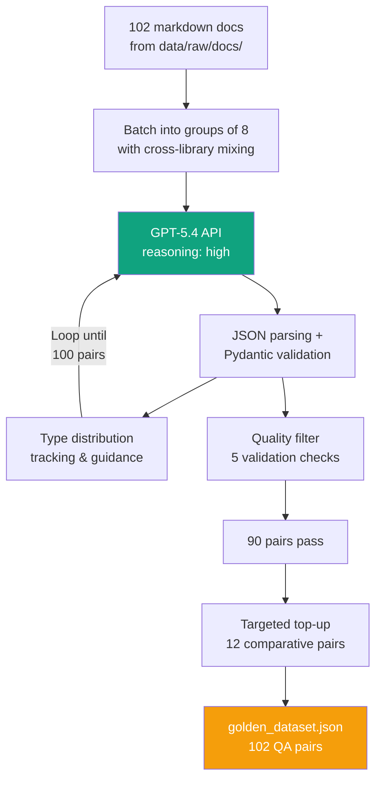

# Golden Dataset Generator for RAG Evaluation

A standalone tool that generates high-quality question-answer pairs from LangChain and LangGraph documentation using OpenAI GPT-5.4 with high reasoning effort. The output is a structured golden evaluation dataset used to benchmark the [lang-chain-graph-rag](https://github.com/SushrutGaikwad/lang-chain-graph-rag) pipeline.

> **Part of a larger project:** This dataset generator is Phase 0 of a production RAG system. See the [full technical writeup](https://sushrutgaikwad.github.io/projects/published/production-level-langchain-langgraph-rag/) and the [main RAG repository](https://github.com/SushrutGaikwad/lang-chain-graph-rag).

---

## Why a Separate Repository?

The golden dataset represents the ground truth against which the RAG system is evaluated. It is deliberately decoupled from the RAG pipeline to ensure:

- **No circular evaluation.** QA pairs are generated from original, unchunked documentation files, not from the same chunks the retriever uses.
- **Stable baseline.** If chunking, embedding, or retrieval logic changes in the RAG pipeline, the evaluation baseline remains untouched.
- **Independent generation.** The dataset is generated by OpenAI GPT-5.4, a different vendor and model than the RAG answer generator (Google Gemini 2.5 Flash) or the evaluator (Anthropic Claude Opus 4.6).

## Dataset Summary

| Metric                            |          Value |
| :-------------------------------- | -------------: |
| Total QA pairs                    |            102 |
| Unique source files referenced    | 85 / 102 (83%) |
| Multi-source pairs                |       36 (35%) |
| Avg. question length              |      127 chars |
| Avg. answer length                |      438 chars |
| Avg. supporting passages per pair |            3.7 |
| Schema errors                     |              0 |
| Duplicate questions               |              0 |

## Question Type Distribution

Each QA pair is classified into one of six categories that test different RAG failure modes:

| Type        | Count | Percentage | What it tests                                          |
| :---------- | ----: | ---------: | :----------------------------------------------------- |
| factual     |    18 |      17.6% | Direct fact retrieval from a single passage            |
| conceptual  |    18 |      17.6% | Synthesizing an explanation from retrieved content     |
| procedural  |    18 |      17.6% | Retrieving and ordering multi-step instructions        |
| comparative |    17 |      16.7% | Pulling relevant chunks for both sides of a comparison |
| multi_hop   |    16 |      15.7% | Combining evidence from multiple chunks or files       |
| edge_case   |    15 |      14.7% | Surfacing boundary conditions, caveats, or limitations |

## Output Schema

```json
{
  "metadata": {
    "total_pairs": 102,
    "generator_model": "gpt-5.4-2026-03-05",
    "reasoning_effort": "high",
    "question_types": [
      "factual", "conceptual", "procedural",
      "comparative", "multi_hop", "edge_case"
    ],
    "topup_applied": true,
    "topup_count": 12
  },
  "qa_pairs": [
    {
      "question": "What partial-data issue can happen while streaming a generative UI spec?",
      "answer": "While the UI spec is streaming in, elements can arrive incompletely...",
      "source_files": ["langchain/frontend/generative-ui.mdx"],
      "supporting_passages": ["exact quote from the documentation..."],
      "question_type": "edge_case"
    }
  ]
}
```

## Project Structure

```
golden-dataset-generator-for-lang-chain-graph-rag/
├── config.py              # Paths, model config, target distribution
├── doc_loader.py          # Recursive markdown file loader
├── qa_generator.py        # GPT-5.4 QA pair generation with batching
├── quality_filter.py      # Validation checks and output writer
├── main.py                # Full generation pipeline
├── topup.py               # Targeted generation for underrepresented types
├── validate.py            # Dataset validation and statistics
├── data/
│   └── raw/
│       └── docs/          # LangChain & LangGraph documentation (.md/.mdx)
└── output/
    └── golden_dataset.json
```

## How It Works



## Getting Started

### Prerequisites

- Python 3.12+
- [uv](https://docs.astral.sh/uv/) package manager
- OpenAI API key with access to GPT-5.4

### 1. Clone and install

```bash
git clone https://github.com/SushrutGaikwad/golden-dataset-generator-for-lang-chain-graph-rag.git
cd golden-dataset-generator-for-lang-chain-graph-rag
uv sync
```

### 2. Configure API key

Create a `.env` file:

```
OPENAI_API_KEY=your-openai-key
```

### 3. Add documentation files

Place your LangChain and LangGraph markdown documentation in `data/raw/docs/`:

```
data/raw/docs/
├── langchain/
│   └── (nested .md/.mdx files)
├── langgraph/
│   └── (nested .md/.mdx files)
└── concepts/
    └── (shared .md/.mdx files)
```

### 4. Generate the dataset

```bash
uv run python main.py
```

This runs the full pipeline: load docs, generate QA pairs in batches via GPT-5.4, quality filter, and save. Takes 15-25 minutes depending on API response times.

### 5. Run the comparative top-up (if needed)

If the quality filter removes too many `comparative` questions:

```bash
uv run python topup.py
```

### 6. Validate the dataset

```bash
uv run python validate.py
```

Checks schema correctness, question type distribution, duplicate detection, content length stats, and prints sample pairs for manual review.

## Quality Checks

The quality filter runs five checks on every generated pair:

1. **Question length** must be at least 20 characters
2. **Answer length** must be between 50 and 2,000 characters
3. **Source files** must be non-empty
4. **Supporting passages** must each be at least 20 characters
5. **Multi-document types** (`comparative`, `multi_hop`) must reference at least 2 source files

Pairs that fail any check are logged and excluded from the final dataset.

## Configuration

Key settings in `config.py`:

```python
MODEL_NAME: str = "gpt-5.4-2026-03-05"
REASONING_EFFORT: str = "high"
TARGET_QA_PAIRS: int = 100

QUESTION_TYPE_TARGETS: dict[str, float] = {
    "factual": 0.18,
    "conceptual": 0.18,
    "procedural": 0.18,
    "comparative": 0.15,
    "multi_hop": 0.16,
    "edge_case": 0.15,
}
```

The generation pipeline tracks cumulative type counts and adjusts guidance to the model in each batch to maintain the target distribution.

## Three-Vendor Context

This generator is one component of a three-vendor evaluation strategy:

| Role                               | Model                     |  Vendor   |
| :--------------------------------- | :------------------------ | :-------: |
| **Dataset generation (this repo)** | GPT-5.4 (reasoning: high) |  OpenAI   |
| RAG answer generation              | Gemini 2.5 Flash          |  Google   |
| Evaluation & scoring               | Claude Opus 4.6           | Anthropic |

No model in the chain evaluates its own output, eliminating self-evaluation bias.

## License

This project is for portfolio and educational purposes.
